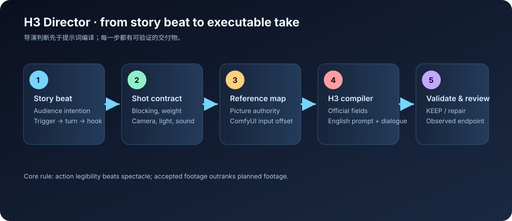
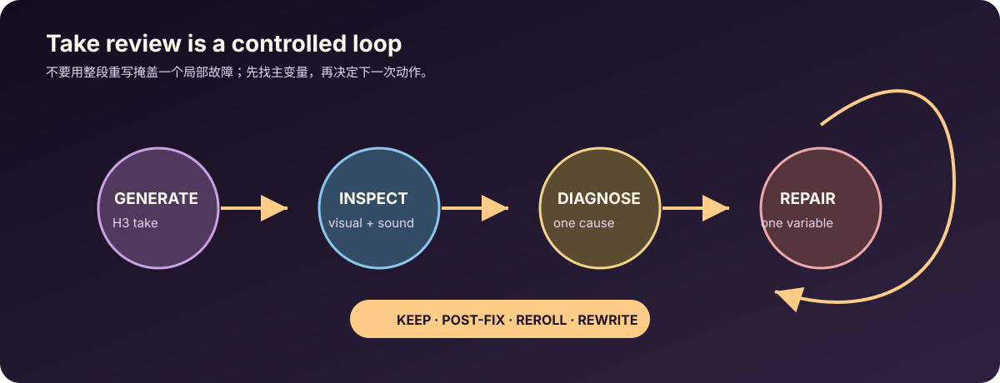
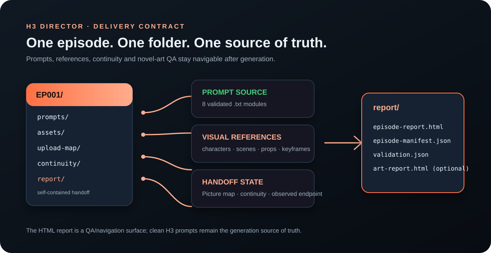

# H3 Director

**Director-first prompt compilation for MiniMax H3 audiovisual generation.**

H3 Director turns a story beat into a compact, production-ready shot contract and then compiles it into the official MiniMax H3 prompt schema. It is designed for vertical dramas, short films, commercials, music-video inserts, and connected 4–15 second clips made with T2VA, I2VA, FL2VA, L2VA, or Ref2VA.

> 中文简介：这是一个面向 MiniMax H3 的导演型提示词 Skill。它先解决“观众要看懂什么、人物如何站住、镜头为什么移动、声音如何落地、下一段从哪里接”的导演问题，再按 H3 官方字段顺序生成可直接放进 ComfyUI 的中文提示词；海外剧对白保留剧本批准的原版英文。它不把 Seedance 语法误塞进 H3，也不把导演分析或内部制作编号污染到最终生成文本。



## What it solves

- **Eight-step production gate** - fixed assets -> spatial map -> first frame -> motivated camera move -> causal action order -> layered sound -> stable last frame -> actual-take continuity repair.
- **Director reasoning** – dramatic turn, blocking, weight and support, eyelines, screen direction, motivated camera movement, lighting continuity, performance, and sound.
- **H3 compliance** — official top-level field order, stable subject/picture labels, exact dialogue tags, strict shot timings, and mode-specific compilation for Ref2VA and base modes.
- **Reference discipline** — every image, video, or audio reference receives one primary authority; the ComfyUI map preserves the H3 Picture 1 → `ref_image_0` offset.
- **Continuity** — accepted footage is treated as canon. Each accepted take gets real start/end frame assets; the exact accepted end frame becomes the next clip's Picture 1 / `ref_image_0` rather than an unverified plan.
- **Model-facing prompt hygiene** — private module IDs, local paths, acceptance status, and missing-file notes stay in the handoff/upload map; the clean H3 prompt contains only connected media labels and executable visible state.
- **Upload-ready packages** — prompts, exact ordered assets, and a README/map can be staged in one per-clip upload folder for ComfyUI.
- **Retake control** — every review returns one verdict: `KEEP`, `POST-FIX`, `REROLL`, or `REWRITE`, with one controlling repair variable for a reroll.

## The production loop



1. Read the beat and recover known project decisions.
2. Complete the eight-step director contract in `references/eight-step-director-workflow.md`.
3. Assign reference authority and produce a ComfyUI upload map.
4. Compile the final H3 prompt: Chinese directing prose by default, with approved overseas dialogue kept in the script's original English.
5. Run both the director-contract validator and the H3 structural validator before generation.
6. Review the generated take, extract and record its real end frame, promote it only if accepted, and repair only what failed.

## Install for Codex

Copy the repository folder to your Codex skills directory:

```powershell
Copy-Item -Recurse -Force . "$env:USERPROFILE\.codex\skills\h3-director"
```

Or clone it directly:

```powershell
git clone https://github.com/egguy886/h3-director.git "$env:USERPROFILE\.codex\skills\h3-director"
```

Restart or refresh Codex after installation so the skill index can discover `SKILL.md`.

## Use it

Ask for the task in production language, for example:

> Use H3 Director. Turn this 15-second vertical drama beat into a Ref2VA prompt, an exact ComfyUI asset map, and a continuity handoff. Keep the dialogue in natural American English and use scene sound only, with no non-diegetic score.

Prompt-language rule: the H3 prompt's directing prose is Chinese by default. For an overseas drama, keep the script-approved dialogue in original English inside the official `<d>[English]...</d>` tag; do not translate or replace it.

The skill returns four objects unless prompt-only output is requested:

1. an eight-section director contract/brief in the working language;
2. an ordered asset upload map;
3. one clean H3 prompt with no commentary;
4. a continuity handoff for the next module.

## Validate a prompt locally

The bundled validators check the eight director sections plus H3 field order, reference labels, shot timing, speaker IDs, and duration bounds:

```powershell
python scripts/validate_director_contract.py examples/blood-moon-bride-m01/director-contract.md --connected
```

```powershell
python scripts/validate_h3_prompt.py examples/blood-moon-bride-m01/prompt-ref2va.txt --mode ref2va --duration 15 --prompt-lang en
```

For Chinese directing prose with original English overseas dialogue, use `--prompt-lang zh`; the validator then does not mistake ordinary Chinese instructions for visible generated text or apply an English-only word-count warning.

The included example is a Ref2VA module from *Blood Moon Bride*: it contains an eight-section director contract, asset map, continuity handoff, validation record, and a ready-to-paste prompt.

## Package a complete episode

When a sequence has approved prompts and visual assets, keep the production handoff in one episode folder instead of scattering files across a project drive. The package contract is documented in [`references/episode-package.md`](references/episode-package.md) and can be built with the bundled deterministic script:



```powershell
python scripts/build_episode_package.py `
  --episode-id EP001 `
  --title "Last Antidote" `
  --source "D:\project\episodes\ep001.md" `
  --prompts-dir "D:\project\prompts" `
  --assets-root characters="D:\project\assets\characters" `
  --assets-root scenes="D:\project\assets\scenes" `
  --assets-root keyframes="D:\project\assets\keyframes" `
  --assets-root props="D:\project\assets\props" `
  --upload-map "D:\project\upload-map\EP001_UPLOAD_MAP.md" `
  --continuity "D:\project\continuity\EP001_CONTINUITY.md" `
  --art-json "D:\project\novel-art\EP001-art.json" `
  --novel-art-report "D:\project\novel-art\art-report.html" `
  --novel-art-images "D:\project\novel-art\images" `
  --out "D:\project\episodes\EP001"
```

The result contains `prompts/`, categorized `assets/`, `upload-map/`, `continuity/`, and `report/episode-report.html`. The merged report previews local images, exposes prompt copy/download actions, shows validator status, links to the optional full `novel-art` report, and exports an `episode-manifest.json`. The clean `.txt` prompts remain the H3 source of truth.

The inspectable example at [`examples/blood-moon-bride-m01/episode-package/EP001/`](examples/blood-moon-bride-m01/episode-package/EP001/) is built with the same contract; open its `report/episode-report.html` to see the navigation surface.

## Repository map

```text
SKILL.md                         Runtime instructions loaded by Codex
agents/openai.yaml               UI metadata for the skill chip
references/                      Director and H3 reference material
scripts/validate_h3_prompt.py    Deterministic H3 structure validator
scripts/validate_director_contract.py
                                 Eight-step director contract validator
examples/                        Small, inspectable production examples
docs/images/                     GitHub-readable visual explanations
references/episode-package.md   Episode folder and merged-report contract
scripts/build_episode_package.py Deterministic episode package/report builder
```

## Provenance and scope

The H3 field rules are aligned to MiniMax’s official prompt-writing skill. The director layer is an original workflow that adapts production reasoning from multimodal video direction patterns, including the Seedance 2.0 director reference listed in [`references/provenance.md`](references/provenance.md). This repository is an independent community project and is not affiliated with MiniMax, OpenAI, or the Seedance authors.

- [MiniMax H3 prompt-writing skill](https://github.com/MiniMax-AI/MiniMax-H3/tree/main/skills/h3-prompt-writing)
- [Seedance 2.0 reference](https://github.com/Emily2040/seedance-2.0)

## License

MIT. See [`LICENSE`](LICENSE).


